## Estrutura da Oficina

- **Módulo 1:** Aprender a estudar com base em fontes confiáveis de pesquisa
- **Módulo 2:** Conduzir uma revisão da literatura como estudo independente
- **Módulo 3:** Organização do fluxo de trabalho e escrita científica
- **Módulo 4:** Ferramentas quantitativas, reprodutibilidade e análise de dados

---

# Tópico 1: Fontes Confiáveis e Busca Acadêmica

---

## Habilidade 1: Fontes Confiáveis de Pesquisa

**Por que essa habilidade importa:**

- O pesquisador em Administração precisa localizar, filtrar e acompanhar a produção científica da sua área.
- Permite construir revisões de literatura consistentes e teoricamente sólidas.

---

## Habilidade 1: Fontes Confiáveis de Pesquisa

- Identificar tendências de pesquisa na fronteira do conhecimento.
- Evitar tomada de decisões com base em fontes frágeis, predatórias ou desatualizadas.

---

## Hierarquia de Indexação e Bases {.study-slide}

- Conhecer a hierarquia entre repositórios, bases e índices de citação é essencial.
- Diferenciar diretórios gerais, indexadores e mecanismos de busca acadêmica especializada.
- Priorizar bases indexadas com controle rigoroso por pares (*peer review*).

---

## Hierarquia de Indexadores

::: {.img-frame}
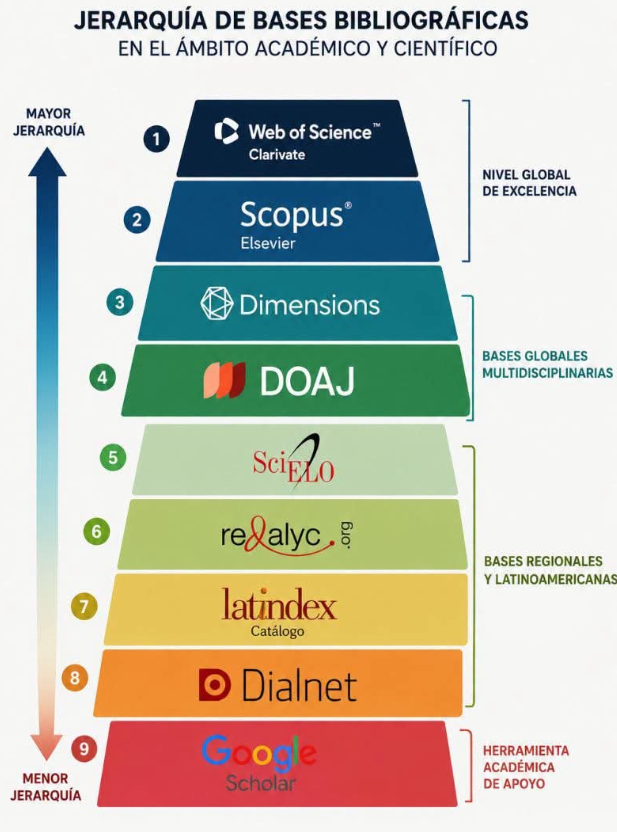
:::

---

## Ferramenta em Destaque: Semantic Scholar

- Mecanismo de busca acadêmica potencializado por IA e grafos de citações.
- Desenvolvido pelo *Allen Institute for AI*.
- Localiza artigos de forma ágil e mapeia conexões entre autores, temas e citações.
- Ponto de partida ideal para revisões de literatura e acompanhamento temático.

---

## Semantic Scholar: Interface e Busca

::: {.img-frame}
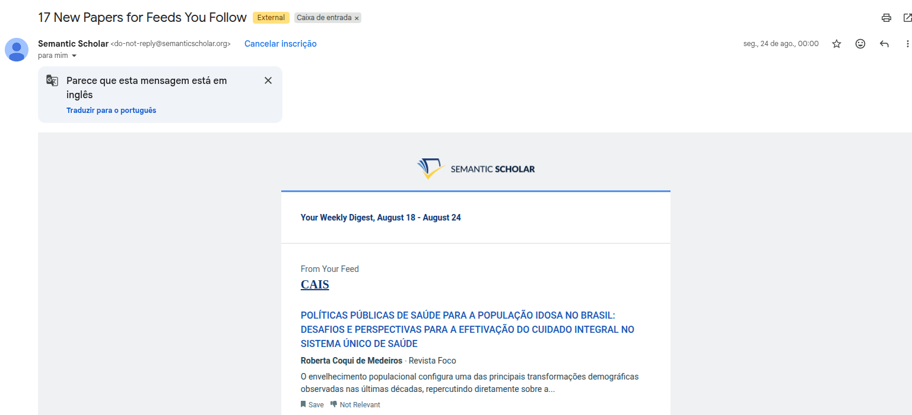
:::

---

## Análise de Artigo no Semantic Scholar

::: {.img-frame}
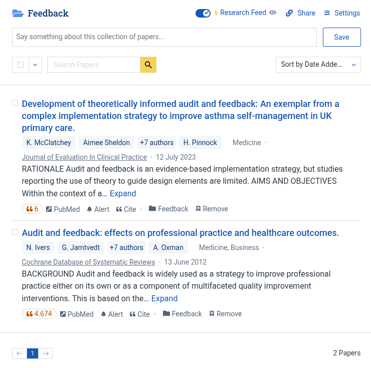
:::

---

## Competências Práticas do Pesquisador {.study-slide}

O que o pesquisador deve dominar ativamente:

- Identificar palavras-chave canônicas e termos booleanos para a sua área.
- Buscar artigos em bases acadêmicas consolidadas e diretórios confiáveis.
- Criar alertas automáticos por tema, autor ou periódico de interesse.

---

## Competências Práticas do Pesquisador (cont.) {.study-slide}

- Acompanhar pesquisadores líderes e redes de cooperação científica.
- Realizar leitura analítica direcionada: problema, método, resultados e referências.

---

## Redes de Pesquisadores e Alertas

::: {.img-frame}

:::

---

## Uso do Semantic Scholar na Prática

1. **Busca e Refinamento:** Iniciar por termos amplos e refinar com operadores, nomes de autores e áreas específicas.
2. **Impacto e Atualidade:** Avaliar simultaneamente os artigos mais citados e as publicações mais recentes.

---

## Uso do Semantic Scholar na Prática (cont.)

3. **Exploração em Cascata:** Percorrer a lista de referências e citações subsequentes (*forward and backward tracking*).
4. **Triagem Rápida:** Analisar resumo, tópicos relacionados e métricas de citação antes do download integral.

---

## Estruturação da Escrita e Métodos

::: {.img-frame}
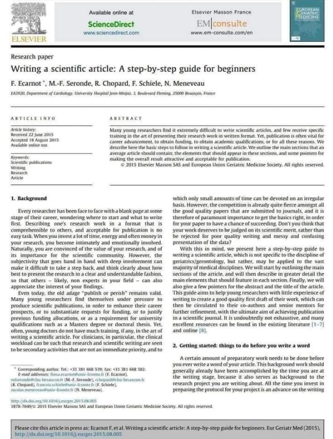
:::

---

## Síntese Metodológica do Tópico 1 {.study-slide}

**Mensagem-chave para os pesquisadores:**

- Pesquisar com rigor não é apenas encontrar arquivos em PDF.
- Consiste em saber selecionar fontes metodologicamente confiáveis.
- Acompanhar de forma sistemática o estado da arte do debate científico.
- Construir repertório empírico e teórico para formular bons problemas de pesquisa.

---

# Tópico 2: Revisão da Literatura como Estudo Independente

---

## Habilidade 2: Revisão como Estudo Independente

**Por que essa habilidade importa:**

- Em Administração, a revisão da literatura não deve ser apenas uma etapa introdutória.
- Pode constituir um **estudo independente**, com questão própria e protocolo analítico explícito.

---

## Habilidade 2: Revisão como Estudo Independente (cont.)

- Indispensável para mapear a evolução temporal de um tema e identificar lacunas conceituais.
- Permite comparar abordagens teóricas concorrentes e verificar o grau de evidência empírica nas relações entre variáveis.

---

## Protocolo e Transparência: PRISMA {.study-slide}

- Exige protocolo metodológico explícito para assegurar rigor e replicabilidade.
- O referencial **PRISMA** orienta com transparência quatro fases essenciais:
  - **Identificação:** Mapeamento abrangente em bases de dados primárias.
  - **Triagem:** Aplicação sistemática de critérios de inclusão e exclusão.

---

## Protocolo e Transparência: PRISMA (cont.) {.study-slide}

- Fases complementares do protocolo:
  - **Elegibilidade:** Leitura analítica do texto integral.
  - **Inclusão:** Síntese, tabulação e categorização do corpus final.
- O protocolo garante rastreabilidade total e auditabilidade ao estudo.

---

## Fluxo Metodológico de Revisão

::: {.img-frame}
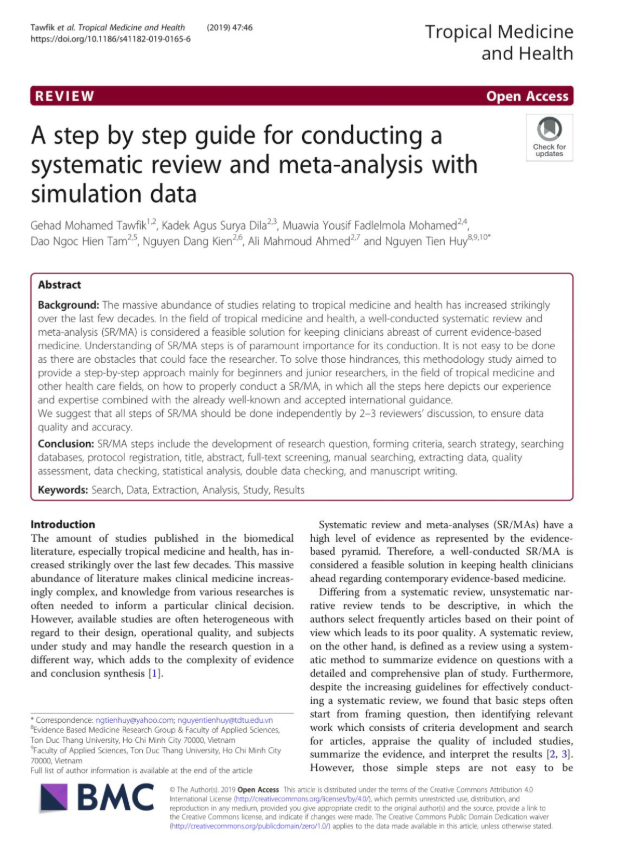
:::

---

## Literatura Nacional e Literatura Cinza {.study-slide}

- **Literatura Internacional:** Conecta a pesquisa ao estado da arte global e aos debates teóricos consolidados.
- **Literatura Nacional:** Essencial para capturar especificidades contextuais, institucionais e regulatórias do Brasil.

---

## Literatura Cinza (*Grey Literature*) {.study-slide}

- Fontes documentais estratégicas:
  - Legislação, consultas públicas e relatórios técnicos governamentais.
  - Relatórios de mercado, demonstrações financeiras e pareceres técnicos.
- *Ignorar a literatura cinza empobrece o diagnóstico do fenômeno estudado.*

---

## Ferramentas para Revisão Estruturada

- **PRISMA:** Protocolo para sistematizar identificação, triagem e inclusão.
- **Litmaps:** Mapeamento visual de redes de citação e artigos seminais.
- **Connected Papers:** Grafo de similaridade para identificar estudos centrais.

---

## Ferramentas para Revisão Estruturada (cont.)

- **Research Rabbit:** Coleções dinâmicas e acompanhamento de coautorias.
- **Leafspace (Elsevier):** Exploração temática e relatórios estruturados.
- **NotebookLM e Google AI Studio:** Síntese com IA e extração analítica.

---

## Mapeamento de Citações: Litmaps

::: {.img-frame}
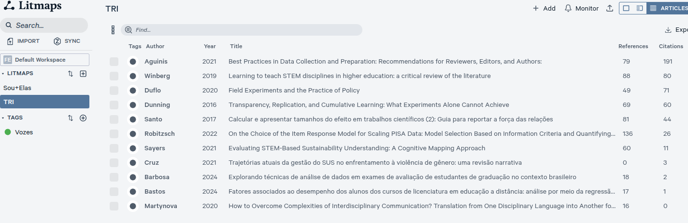
:::

---

## Linha do Tempo e Conexões no Litmaps

::: {.img-frame}
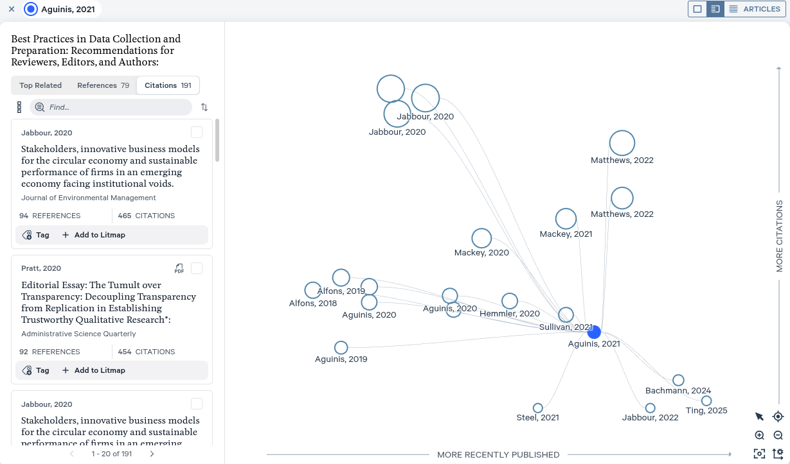
:::

---

## Exploração com Leafspace (Elsevier)

::: {.img-frame}
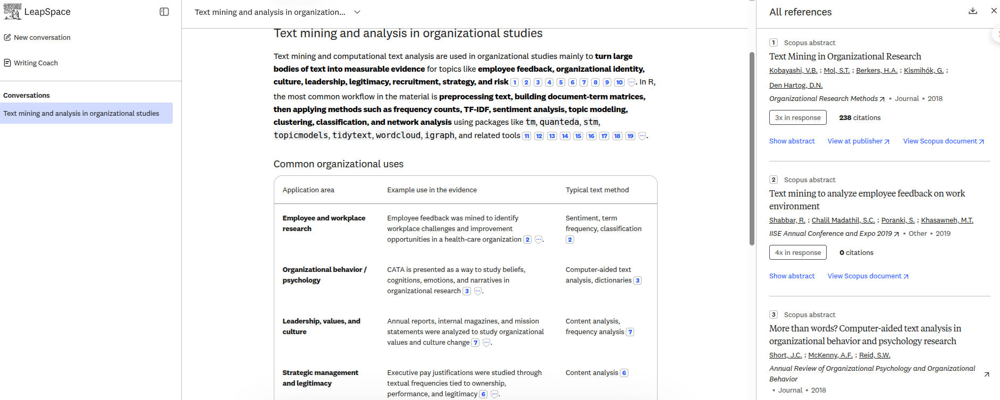
:::

---

## Gestão e Roteiro de Estudos

::: {.img-frame}
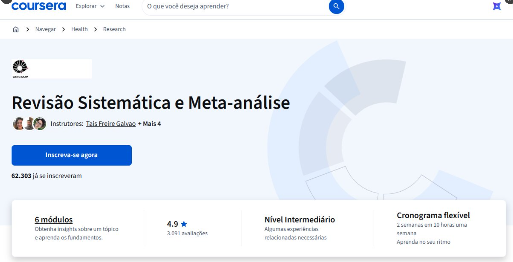
:::

---

## Síntese e Análise com NotebookLM

- Modelos de linguagem com ancoragem restrita às fontes carregadas (*grounding*).
- Permite carregar diretamente a seleção final de PDFs e notas de pesquisa.
- Geração de resumos orientados, listas de ideias e mapas conceituais.
- Consulta precisa com indicação direta de trechos dos textos originais.

---

## NotebookLM na Prática

::: {.img-frame}
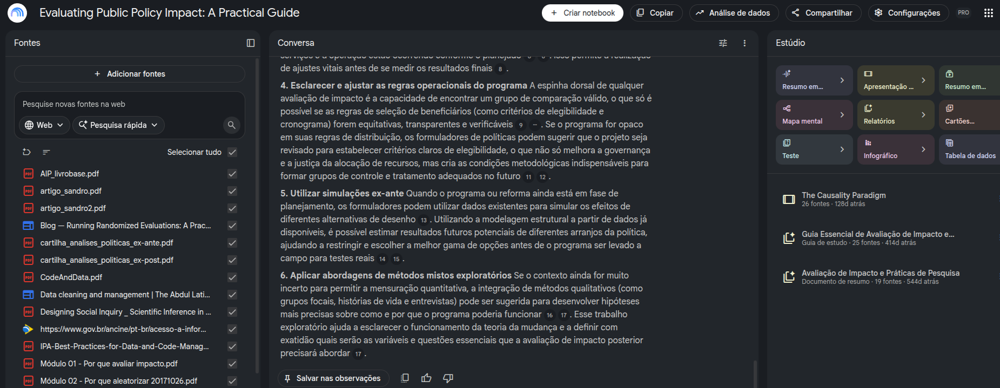
:::

---

## Automação e Fluxos com Google AI Studio

- Ambiente de desenvolvimento para prototipar prompts avançados e fluxos estruturados.
- Rotinas para:
  - Categorização automática de resumos por área, método e evidência.
  - Extração padronizada de variáveis dependentes, independentes e mediadoras.
  - Detecção sistemática de lacunas teóricas e limitações metodológicas.

---

## Google AI Studio: Estruturação de Prompts

::: {.img-frame}
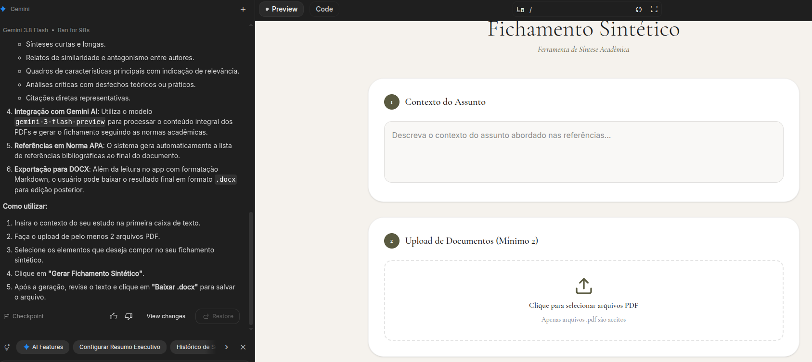
:::

---

## Google AI Studio: Execução e Parâmetros

::: {.img-frame}
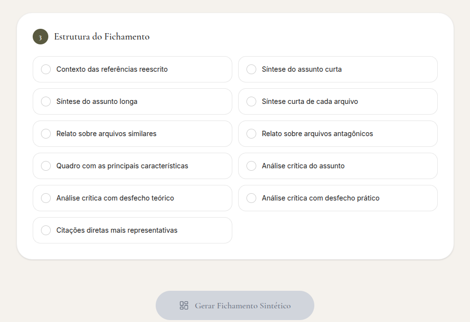
:::

---

## Protocolo do Pesquisador {.study-slide}

**Diretrizes obrigatórias de execução:**

1. Formular uma questão de pesquisa precisa e delimitada para a revisão.
2. Definir e registrar critérios formais de inclusão e exclusão de estudos.
3. Especificar bases de dados, strings booleanas e operadores de busca.

---

## Protocolo do Pesquisador (cont.) {.study-slide}

4. Ler os artigos examinando sistematicamente: construtos, método, resultados e vieses.
5. Organizar evidências por matrizes temáticas, e não como mera listagem de resumos descritivos.

---

## Síntese Crucial do Tópico 2 {.study-slide}

**Mensagem-chave para os pesquisadores:**

- Uma revisão rigorosa exige método, clareza de propósito e disciplina analítica.
- Quando conduzida como estudo independente, transcende o levantamento trivial:
  - Gera mapas conceituais consistentes e robustos.
  - Estabelece as fronteiras teóricas e empíricas da disciplina.
  - Constitui uma contribuição científica independente e publicável.

---

# Tópico 3: Fluxo de Trabalho, Escrita e Publicação Científica

---

## Habilidade 3: Fluxo de Trabalho e Escrita Científica

**Por que essa habilidade importa:**

- Escrever um artigo científico exige método, consistência conceitual, rigor nas referências e planejamento editorial.
- Em Administração, é essencial construir um fluxo integrado:  
  **leitura $\rightarrow$ fichamento $\rightarrow$ escrita $\rightarrow$ revisão $\rightarrow$ submissão**.

---

## Habilidade 3: Fluxo de Trabalho e Escrita Científica (cont.)

- Um fluxo de trabalho estruturado previne perdas de tempo e retrabalhos manuais de formatação.
- Evita inconsistências de citação que costumam atrasar a aprovação do manuscrito.

---

## Gestão de Referências com Zotero

- Organização sistemática de artigos em coleções temáticas, projetos e disciplinas.
- Leitura integrada com marcações, notas estruturadas e extração de metadados.
- Integração direta com processadores de texto e Quarto via arquivos `.bib` padronizados.
- Geração automática de citações em normas ABNT, APA e padrões de periódicos.

---

## Zotero na Prática: Organização e Fichamento

::: {.img-frame}
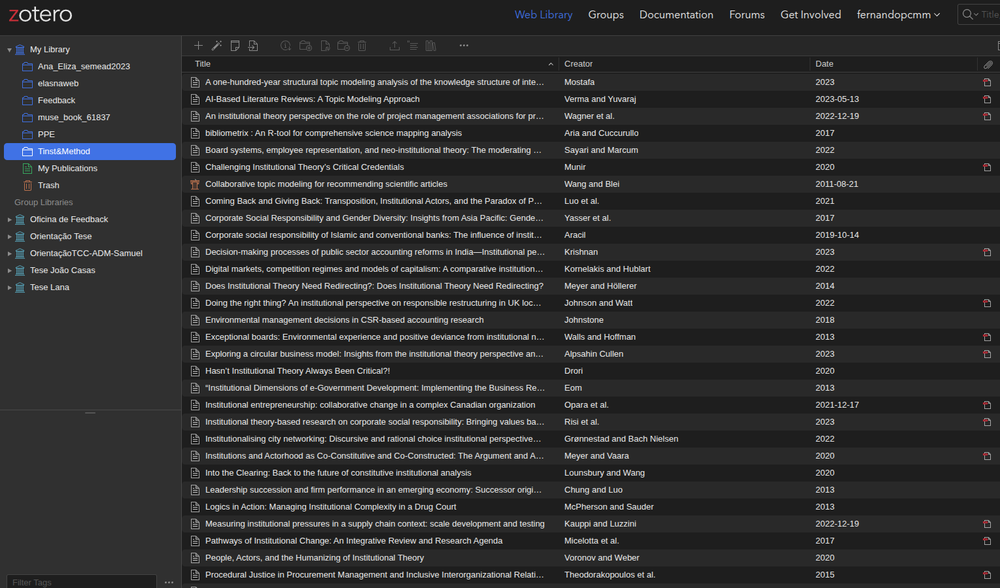
:::

---

## Revisão Linguística e Clareza Acadêmica

- **Grammarly e Ferramentas de Estilo:**
  - Diagnóstico de concordância, concisão e tom acadêmico formal em inglês.
  - Ajuste de fluidez, ritmo das sentenças e eliminação de ambiguidades.
  - Preservação da voz autoral sem empobrecer o vocabulário técnico.
- *Revisão em blocos incrementais:* ciclos frequentes de refinamento textual por seções.

---

## Automação e Produtividade via CLI {.study-slide}

- **Interfaces de Linha de Comando (CLI):**
  - Desenvolvem autonomia técnica e reprodutibilidade no ecossistema de pesquisa.
  - Controle granular de arquivos, scripts de automação e versionamento com Git.
  - Conectam escrita (Markdown/Quarto), dados e formatação em um fluxo auditável.

---

## Ferramentas CLI: Antigravity

- Ambiente de assistência agentica avançada em linha de comando.
- Apoio na automação de checagens, conversões de documentos e suporte ao fluxo de redação acadêmica.

::: {.img-frame}
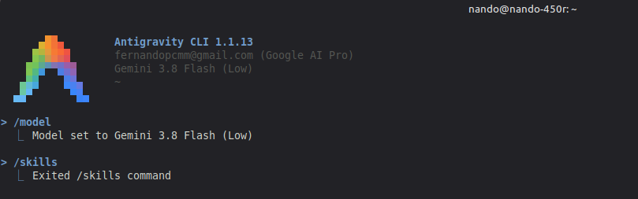
:::

---

## Ferramentas CLI: OpenCode

- Solução para fluxos abertos de código, manipulação eficiente de arquivos de texto e integração com repositórios.

::: {.img-frame}
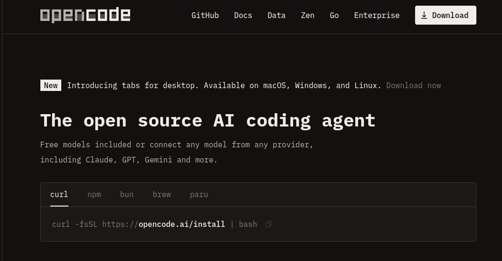
:::

---

## Estratégia de Escolha do Periódico

- A escolha do periódico deve alinhar escopo, contribuição teórica e perfil metodológico do manuscrito.
- **Buscadores de Journal (*Journal Finders*):**
  - Ferramentas das principais editoras (Elsevier, Springer, Wiley, Taylor & Francis).
  - Cruzamento de título, resumo e termos com a base histórica da revista.
  - Avaliação de métricas (JCR/Impact Factor, CiteScore), tempo de revisão e taxas de rejeição.

---

## Mapeamento de Periódicos em Administração

::: {.img-frame}
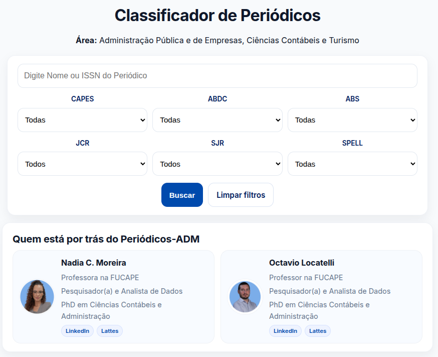
:::

---

## Acordos Transformativos da CAPES {.study-slide}

- **Publicação em Acesso Aberto com APC Financiado:**
  - Acordos da CAPES cobrem taxas de processamento de artigos (*Article Processing Charges*).
  - Válido para autores correspondentes com vínculo elegível no Portal de Periódicos.
  - **Acordo CAPES-Elsevier (2026-2028):** viabiliza acesso aberto em periódicos híbridos elegíveis com cobertura integral do APC.

---

## Acordos Transformativos da CAPES (cont.) {.study-slide}

- *Regra inegociável:* Verificar previamente a elegibilidade do periódico e da filiação institucional antes de submeter.
- Evita surpresas orçamentárias e custos imprevistos ao término do processo avaliativo.

---

## Portal de Periódicos e Acordo CAPES

::: {.img-frame}
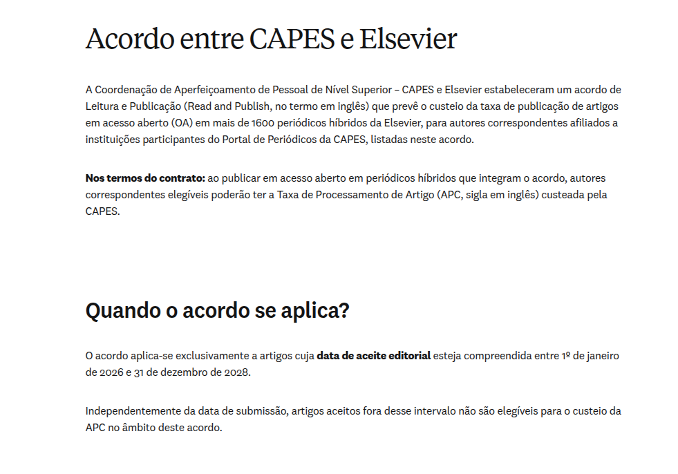
:::

---

## Protocolo do Pesquisador para Escrita e Envio {.study-slide}

**Diretrizes práticas de execução:**

1. Estruturar a biblioteca do Zotero antes de iniciar a primeira linha de redação.
2. Escrever em seções concisas com ciclos rápidos e frequentes de revisão de estilo.
3. Incorporar rotinas de automação técnica (CLI, Git, Quarto) para tarefas repetitivas.

---

## Protocolo para Escrita e Envio (cont.) {.study-slide}

4. Mapear de 3 a 5 periódicos aderentes ao escopo e verificar cobertura de APC pela CAPES.
5. Realizar auditoria formal de citações, consistência de dados e declarações éticas antes do envio.

---

## Síntese Crucial do Tópico 3 {.study-slide}

**Mensagem-chave para os pesquisadores:**

- A qualidade de um artigo científico é fruto de método, disciplina e ferramentas adequadas.
- Dominar o fluxo integrado de trabalho:
  - Poupa semanas de retrabalho manual.
  - Elimina falhas de citação e inconsistências metodológicas.
  - Amplia as chances reais de aceite em periódicos de excelência.

---

# Tópico 4: Ferramentas Quantitativas e Análise de Dados

---

## Onde estão os dados?

::: {.img-frame}

:::

---

## Ferramentas Computacionais de Análise

::: {.img-frame}
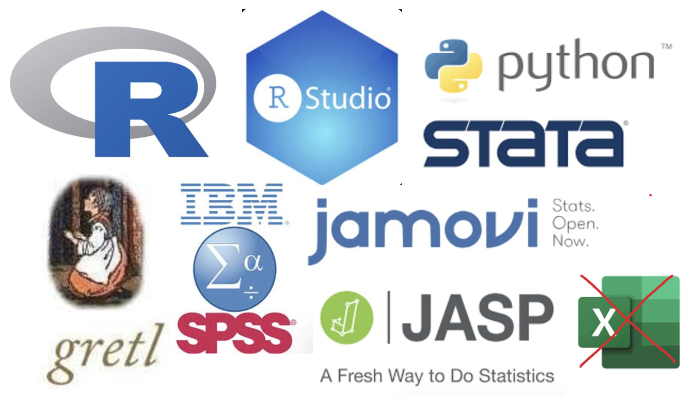
:::

---

## Técnicas Comuns em Organizações {.study-slide}

- Mapeamento e categorização das abordagens metodológicas na área:
  - **Exploração de dados**
  - **Análise multivariada**
  - **Estudos de validação**

*(Complementação e detalhamento de técnicas a serem discutidas no quadro).*

---

## Técnicas Comuns em Organizações (cont.) {.study-slide}

- Abordagens complementares e contemporâneas:
  - **Métodos mistos**
  - **Análise textual computacional**
  - **Machine learning**

*(Complementação e detalhamento de técnicas a serem discutidas no quadro).*
